# Software-Architektur und Referenz

Vollständige Übersicht über Aufbau, Schnittstellen, Klassen und Funktionen von
CC-Giveaway. Stand: 10. August 2026 (Commit `bfa62ff`).

Dieses Dokument beschreibt **was es gibt und wie es zusammenhängt**. Die
fachlichen Regeln stehen in [CLAUDE.md](../CLAUDE.md) (verbindlich),
[FEATURES.md](../FEATURES.md) (Einstellungen) und
[docs/ARCHITEKTUR-CORES.md](ARCHITEKTUR-CORES.md) (Mechanik-Verträge).

Inhalt:
[1. Systemüberblick](#1-systemüberblick) ·
[2. Laufzeitsicht](#2-laufzeitsicht-prozesse-und-kanäle) ·
[3. Datenhaltung](#3-datenhaltung) ·
[4. Programmablauf](#4-programmablauf) ·
[5. Klassen und Module](#5-klassen-und-module) ·
[6. Funktionsreferenz](#6-funktionsreferenz) ·
[7. Schnittstellen](#7-schnittstellen) ·
[8. Konfiguration](#8-konfiguration) ·
[9. Invarianten](#9-invarianten-was-nicht-gebrochen-werden-darf)

---

## 1. Systemüberblick

Acht Container: sechs tragende Dienste plus zwei Helfer (`cc-backup`,
tägliche Sicherung 03:00, und `cc-redis-ui`, nur auf dem Loopback). Ein
Datenstrom kommt von außen (Streamerbot der Kanäle), einer geht zurück
(Chat-Antworten). Alles andere ist interne Kommunikation.

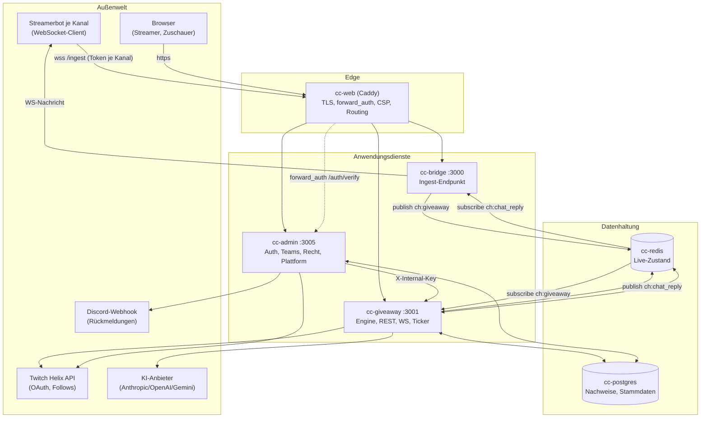

**Warum diese Aufteilung**

| Dienst | Aufgabe | Warum getrennt |
|---|---|---|
| `bridge` | nimmt Streamerbot-Verbindungen an, prüft Kanal-Token, leitet Ereignisse weiter | Der Ingest ist der einzige Weg von außen in den Zustand. Getrennter Prozess heißt: eigene Drosselung, eigener Absturzradius. |
| `giveaway` | Engine, Zeitkonto, Ziehung, Preise, Contest, Audit | Enthält den gesamten Live-Zustand und ist der einzige Dienst mit Redis-Zugriff. |
| `admin` | Login, Teams, Rechtstexte, DSGVO, Plattform-Verwaltung | Kennt Personen und Rechtstexte; hat bewusst **kein** Redis. |
| `cc-web` (Caddy) | TLS, Pfad-Routing, `forward_auth`, Security-Header | Authentifizierung genau einmal, vor allen Diensten. |
| `redis` | Live-Zustand + Pub/Sub | Zustand, der pro Sekunde wächst, gehört nicht in die Nachweis-Datenbank. |
| `postgres` | Nachweise, Stammdaten, Protokolle | Alles, was revisionssicher bleiben muss. |

---

## 2. Laufzeitsicht: Prozesse und Kanäle

### 2.1 Ingest (von außen nach innen)

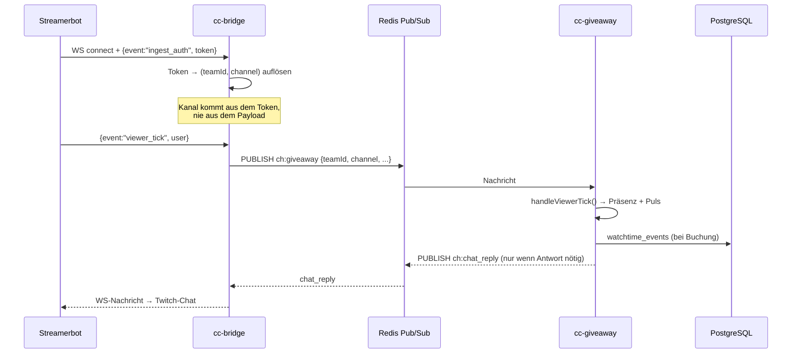

Ereignisse auf `ch:giveaway`: `viewer_tick`, `chat_msg`, `time_cmd`,
`giveaway_cmd`, `stream_online`, `stream_offline`, `cc_debug`.
Rückkanal `ch:chat_reply`: `{event:'chat_reply', channel, message}`.

### 2.2 Zeitkonto (Ticker, 60 s)

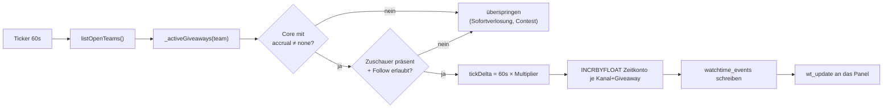

### 2.3 Panel (WebSocket)

Das Admin-Panel hält eine WS-Verbindung zu `cc-giveaway`. Identität kommt aus
dem Header `X-Auth-User`, den Caddy nach `forward_auth` setzt — der Client kann
sie nicht behaupten.

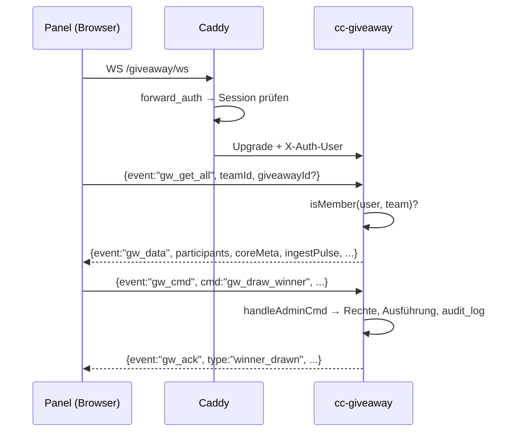

---

## 3. Datenhaltung

### 3.1 Redis — Live-Zustand

Namensraum `t:<teamId>:…` (team-weit) und `t:<teamId>:g:<sessionId>:…` (je
Giveaway). Konstruiert wird jeder Schlüssel über die Tabelle `K` in
[watchtime.js](../services/giveaway/watchtime.js) — **nie per String-Konkatenation im Aufrufer**.

| Schlüssel | Typ | Bedeutung |
|---|---|---|
| `gw:open_teams` | Set | global: Teams mit laufendem Giveaway (Ticker-Kandidaten) |
| `t:<T>:gw_open` / `gw_paused` | String | Kampagne offen / pausiert |
| `t:<T>:gw_keyword`, `gw_session_id` | String | Keyword und Sitzungs-ID der Kampagne |
| `t:<T>:gw:channels` | String (JSON) | Kanal-Cache aus PG |
| `t:<T>:gw:users` | Set | alle je gesehenen Zuschauer des Teams |
| `t:<T>:gw:online` | Set | aktuell live gemeldete Kanäle (`stream_online`) |
| `t:<T>:gw:cfg:*` | String | **Vorgaben** für das nächste Giveaway |
| `t:<T>:gw:registered:<u>`, `gw_banned:<u>` | String | Opt-in / Sperre (team-weit) |
| `t:<T>:gw:ch:<C>:watch\|msgs\|chat_ts:<u>` | String | Legacy-Kampagnenkonto je Kanal |
| `t:<T>:gw:ch:<C>:present:<u>` | String, TTL 600 s | Anwesenheit (Tick oder Chat) |
| `t:<T>:gw:ch:<C>:last_tick:<u>` | String | Zeitpunkt des letzten `viewer_tick` |
| `t:<T>:gw:ch:<C>:pulse` | String | letzter Tick **des Kanals** (Ingest-Diagnose) |
| `t:<T>:gw:ch:<C>:index` | Set | Zuschauer je Kanal |
| `t:<T>:giveaways` | Set | aktive und geschlossene, noch nicht aufgeräumte Instanzen |
| `t:<T>:g:<S>:open\|paused\|keyword\|channels\|core\|name` | String | Zustand der Instanz |
| `t:<T>:g:<S>:win_end` | String | Ende des Anmeldefensters (Sofortverlosung) |
| `t:<T>:g:<S>:wager_cmd`, `min_watch`, `vote_state`, `announce` | String | Core-spezifische Einstellungen |
| `t:<T>:g:<S>:cfg:*` | String | **Kopie** der Regeln beim Öffnen (Copy-on-Open) |
| `t:<T>:g:<S>:ch:<C>:watch\|msgs\|chat_ts:<u>`, `registered:<u>`, `mult` | String | Konto der Instanz |
| `t:<T>:gw:abuse:hist\|times:<u>` | List | Anti-Abuse-Fenster |
| `ingest:tokens`, `ingest:team_tokens` | Hash | Ingest-Token ↔ (Team, Kanal) |

### 3.2 PostgreSQL — Nachweise und Stammdaten

`ensureSchema()` beim Start ist die Quelle der Wahrheit; `postgres/init.sql`
legt nur das Grundgerüst eines frischen Volumes an.

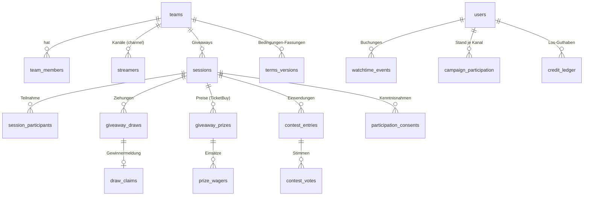

| Tabelle | Zweck | Besonderheit |
|---|---|---|
| `teams`, `team_members`, `streamers` | Team, Mitglieder, Kanäle und Twitch-Token | `teams.deactivated_at` statt DELETE; `streamers.banned_at` = Login-Sperre |
| `sessions` | eine Zeile je Giveaway (Kampagne oder Instanz) | `core`, `core_config`, `status`, `terms_version`, `prize`, `sponsor` |
| `watchtime_events` | jede Zeitbuchung | Grundlage jeder Nachrechnung |
| `campaign_participation` | Stand je (Sitzung, Nutzer, Kanal) | wird beim Schließen geschrieben |
| `giveaway_draws` | jede Ziehung mit Snapshot | `eligible_snapshot`, `rand_value`, `reroll_of` — **nie löschen** |
| `draw_claims` | Gewinnermeldung | einzige Klardaten (Name/Anschrift), Löschfrist 12 Monate |
| `credit_ledger` | Los-Guthaben | append-only, nur Gegenbuchungen |
| `giveaway_prizes`, `prize_wagers` | Preise und Einsätze | append-only, Rücknahme = negative Zeile |
| `contest_entries`, `contest_votes` | Screenshots und Stimmen | Bild als `BYTEA`, Zugriff nur über `image_token` |
| `participation_consents` | Kenntnisnahme je Aktion | register / wager / contest_entry / contest_vote |
| `terms_versions`, `tos_acceptances` | Teilnahmebedingungen, Nutzungsbedingungen | versioniert, append-only |
| `audit_log` | jede zustandsändernde Aktion | append-only, wird nur anonymisiert |
| `abuse_flags`, `platform_warnings`, `feedback`, `debug_log` | Auffälligkeiten, Verwarnungen, Rückmeldungen, Streamerbot-Debug | |

---

## 4. Programmablauf

### 4.1 Lebenszyklus eines Giveaways

Für **alle** Mechaniken gilt seit 9.8.2026: schließen → ziehen → aufräumen.

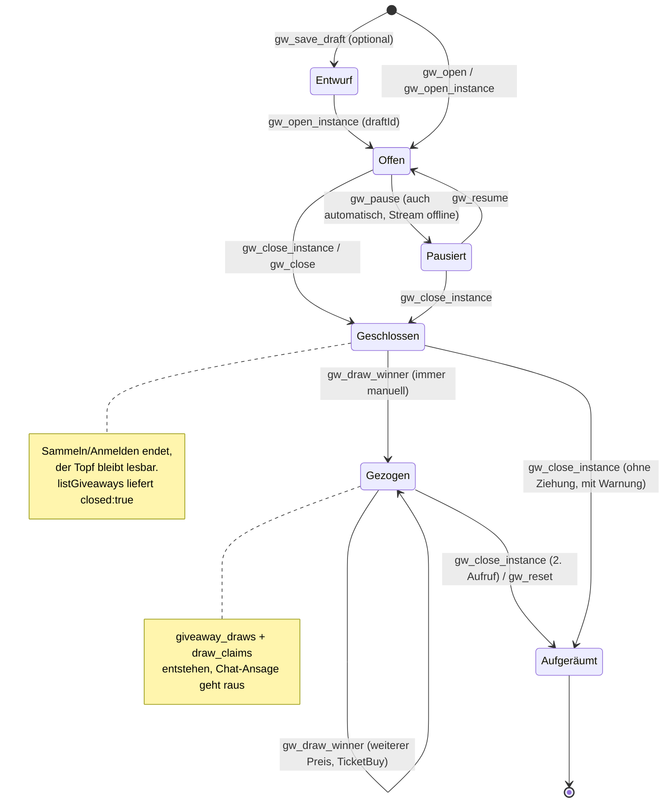

**Start-Gates** vor jedem Öffnen, in dieser Reihenfolge:

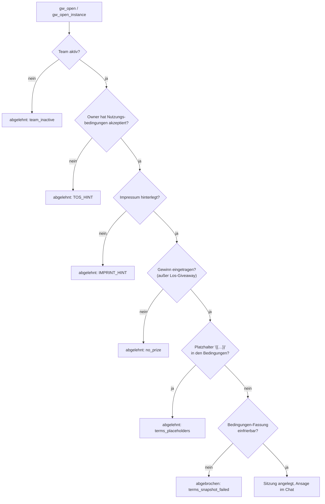

### 4.2 Chat-Nachricht: der heißeste Pfad

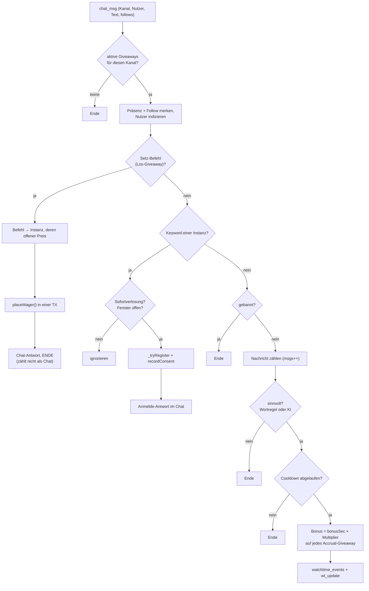

Die KI-Bewertung ist **fail-open**: Timeout (4 s) oder Fehler fallen auf die
Wortregel zurück, der Chat blockiert nie.

### 4.3 Ziehung

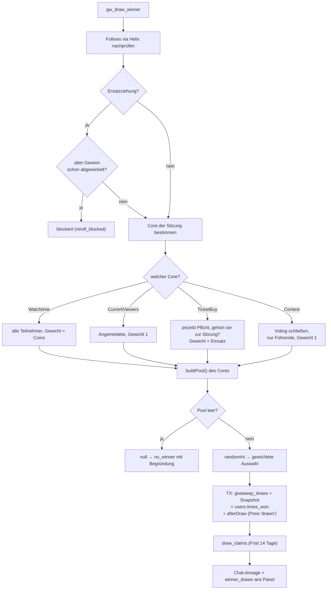

### 4.4 Berechtigung je Mechanik

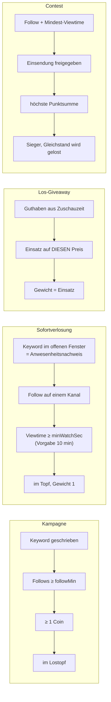

---

## 5. Klassen und Module

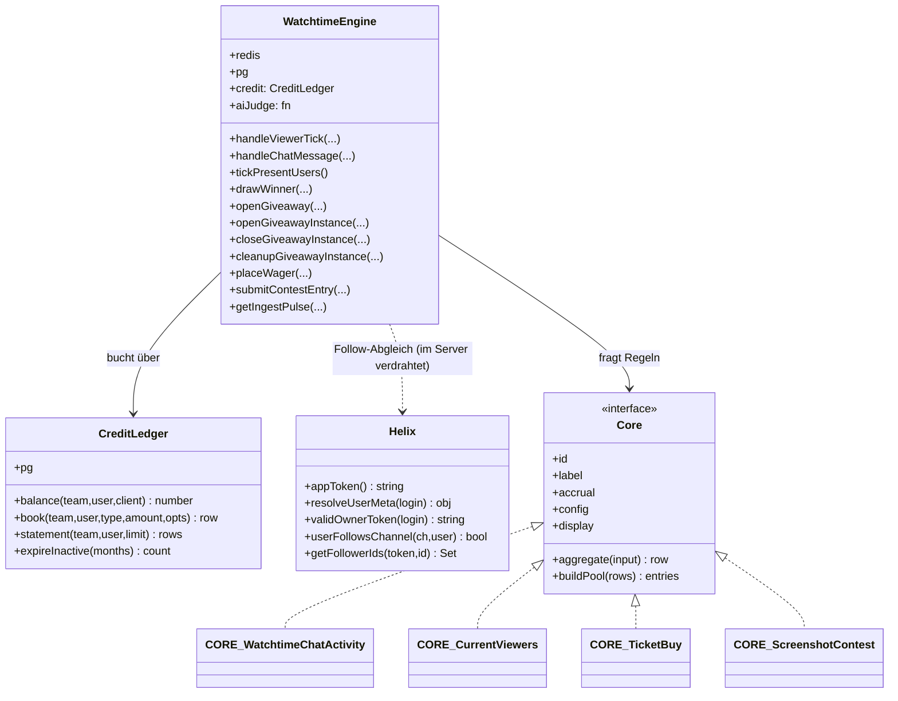

### Modulkarte

| Modul | Art | Abhängigkeiten | Testbar ohne Infrastruktur |
|---|---|---|---|
| `services/giveaway/watchtime.js` | Klasse `WatchtimeEngine` | redis, pg, Cores, CreditLedger | ja (Mocks) |
| `services/giveaway/credit.js` | Klasse `CreditLedger` | pg | ja |
| `services/giveaway/cores/index.js` | Registry | Core-Module | ja |
| `services/giveaway/cores/*.js` | reine Funktionen je Mechanik | — | ja |
| `services/giveaway/cores/chat-ai.js` | KI-Bewertung + Krypto | fetch (stubbar) | ja |
| `services/giveaway/terms.js` | Fassungs-Snapshot | pg, fetch | ja |
| `services/giveaway/claim-rules.js` | Ersatzziehungs-Regeln | — | ja |
| `services/giveaway/targz.js` | ustar-Writer | — | ja |
| `services/giveaway/helix.js` | Klasse `Helix` | fetch, pg, redis | nein (Netz) |
| `services/giveaway/server.js` | Prozess: REST, WS, Ticker, Audit | alles | nein |
| `services/admin/auth.js` | reine Auth-Helfer | bcrypt, crypto | ja |
| `services/admin/server.js` | Prozess: Auth, Teams, Recht, Plattform | pg, fetch | nein |
| `services/bridge/server.js` | Prozess: Ingest | redis, ws | nein |

---

## 6. Funktionsreferenz

Konventionen: `T` = Team-ID (`team_<hex>`), `S`/`gid` = Sitzungs-ID
(`sess_<ms>`), `u` = Twitch-Login (klein, `[a-z0-9_]`, max 25),
`ch` = Kanal. Alle `async`-Funktionen liefern ein Promise.
Fehler werden fast überall als `{ error: '<code>' }` **zurückgegeben** statt
geworfen; geworfen wird nur, wo ein Abbruch zwingend ist (siehe Spalte).

### 6.1 `WatchtimeEngine` — Konfiguration und Zustand

| Methode | Parameter | Rückgabe |
|---|---|---|
| `constructor(redis, pg, aiJudge=null)` | Redis-Client, PG-Pool, optionale KI-Funktion `(teamId,msg)→bool\|null` | Instanz; legt `this.credit = new CreditLedger(pg)` an |
| `getChannels(T)` | — | `string[]` Kanäle des Teams (Redis-Cache, sonst aus `streamers`) |
| `resolveChannel(T, ch)` | Kanalname | `string\|null` — normalisiert, `null` wenn nicht zum Team gehörend |
| `getMultiplier(T, gid?)` | — | `number` (1 = aus); Instanz vor Team |
| `setMultiplier(T, factor, seconds, gid?)` | Faktor 1–10, Dauer | `{ factor, until }` |
| `multiplierState(T, gid?)` | — | `{ factor, secondsLeft }` |
| `getFollowMin(T, gid?)` / `setFollowMin(T, n, gid?)` | Anzahl Kanäle | `number` / `void` |
| `getCoinBaseSec(T, gid?)` / `setCoinBaseSec(T, sec, gid?)` | Sekunden je Coin | `number` / `void` |
| `getDrawMinSec` / `setDrawMinSec` | Alias auf Coin-Basis | wie oben |
| `getChatConfig(T, gid?)` / `setChatConfig(T, cfg, gid?)` | `{minWords, bonusSec, cooldown}` | Objekt / `void` |
| `copyCfgToInstance(T, gid)` | — | `void` — Copy-on-Open der Accrual-Regeln |
| `isOpen/isPaused/isActive(T, gid?)` | — | `boolean` |
| `setPaused(T, paused, gid?)` | — | `void` |
| `getSessionId(T)` | — | `string\|null` (Kampagne) |
| `listOpenTeams()` | — | `string[]` |
| `getUserTeams(u)` | — | `string[]` |
| `getCoreId(T, gid)` | — | Core-ID, Fallback `CORE_WatchtimeChatActivity` |
| `validateSessionId(id)` | — | wirft `Error('Invalid sessionId')` bei Formatverstoß |

### 6.2 `WatchtimeEngine` — Ereignisse und Konten

| Methode | Parameter | Rückgabe |
|---|---|---|
| `handleViewerTick(T, ch, u, follows)` | Präsenzmeldung | `null`; setzt `last_tick`, `pulse`, `present`, Follow-Flag, Index |
| `tickPresentUsers()` | — | `Array<{teamId, giveawayId, primary, username, channel, watchSec, coins}>` — eine Zeile je Buchung |
| `handleChatMessage(T, ch, u, msg, follows)` | Chatzeile | `null` · `{chatReply, channel}` (Setz-Befehl/Antwort) · `{...agg, registered, isNew}` (Anmeldung) · `{added, channel, watchSec, coins}` (Bonus) |
| `recordConsent(T, gid, u, action, source='chat')` | Aktion `register\|wager\|contest_entry\|contest_vote` | `void`, idempotent je (Sitzung, Nutzer, Aktion) |
| `registerUser(T, u)` | — | `{registered:true}` |
| `unregisterUser(T, u, gid?)` | Opt-in zurückziehen | `{ok:true, giveawayId}` · `{error:'not_registered'\|'bad_request'}` |
| `adjustWatch(T, u, ch, deltaSec)` | manuelle Korrektur | `{username, channel, watchSec}` |
| `setBanned(T, u, banned)` | — | `void` |
| `getUserAggregate(T, u, gid?)` | — | Core-`aggregate`-Objekt: `{username, perChannel, totalWatchSec, totalCoins, channelsFollowed, registered, banned, eligible, coins, watchSec, msgs, …}` |
| `getAllParticipants(T, gid?)` | — | `Array<aggregate & {flags}>`, absteigend nach Coins |
| `flagUser(T, u, reason, detail)` | Auffälligkeit | `void` (Upsert mit Zähler) |
| `getFlagsMap(T)` | — | `{ [username]: Array<{reason, count}> }` |
| `getIngestPulse(T, channels?)` | Diagnose | `Array<{channel, lastTickAgo\|null, present, online, silent, stale}>` — `stale` nur wenn **Stream online und trotzdem still** |

### 6.3 `WatchtimeEngine` — Giveaways

| Methode | Parameter | Rückgabe / Wirkung |
|---|---|---|
| `openGiveaway(T, keyword, sessionId)` | Kampagne öffnen | `void`; setzt Redis-Zustand, kopiert Regeln |
| `openGiveawayInstance(T, gid, opts)` | `opts = {keyword, channels, core, windowSec, wagerCmd, minWatchSec, announce, name}` | `void`; **wirft** `Error('duplicate_core')` bei zweitem Contest |
| `listGiveaways(T, {stats})` | `stats` lädt Zusatzdaten | `Array<{gid, primary, closed, core, paused, keyword, channels, windowEndsAt, announce, name, startedAt?, prize?, sponsor?, participants?}>` |
| `openInstantWindow(T, gid, windowSec)` | Anmeldefenster | `{windowSec, endsAt}` |
| `closeGiveawayInstance(T, gid)` | Schritt 1 | `void`; `open=false`, Fenster zu, **Topf bleibt** |
| `cleanupGiveawayInstance(T, gid)` | Schritt 3 | `void`; löscht alle `g:<gid>:*`-Schlüssel und den Set-Eintrag |
| `closeGiveaway(T, sessionId)` | Kampagne schließen | `void`; schreibt `campaign_participation`, Sitzung bleibt ziehbar |
| `resetGiveaway(T)` | — | `{wipedParticipants, wipedCoins, wipedEligible, sessionBefore}` |
| `drawWinner(T, sessionId, opts)` | `opts = {test, prize, prizeId, rerollOf, rerollReason, excludeWinner}` | `null` bei leerem Pool, sonst `{winner, coins, watchSec, drawId, drawIndex, sessionId, eligibleCount, total, rand, isTest, prize, prizeId, core, msgs}`; **wirft** bei fehlender `prizeId` (TicketBuy) und bei `prize_not_in_giveaway` |
| `previewEligible(T, {core, channels, minWatchSec})` | Vorschau vor dem Start | `{count, basis, …}` mit `basis` = `campaign\|present\|credit\|contest` |
| `getInstantParticipants(T, gid)` | Sofortverlosung | `Array<aggregate & {present, watchOk, followOk, minWatchSec}>` |
| `getTicketBuyParticipants(T, gid)` | Los-Giveaway | `Array<{username, balance, stake, banned, registered, eligible}>` |
| `getContestParticipants(T, gid)` | Contest | `Array<{username, title, status, score, votes, …}>` |
| `exportTeam(T)` / `importTeam(T, data, opts)` | Backup | JSON-Objekt / `{imported, skipped, mode}` |

### 6.4 `WatchtimeEngine` — Los-Giveaway

| Methode | Parameter | Rückgabe |
|---|---|---|
| `addPrize(T, gid, {title, description, wagerEndTs})` | — | `number` (Preis-ID); **wirft** `Error('prize_exists')`, wenn die Instanz schon einen offenen Preis hat |
| `listPrizes(T, {openOnly=true, gid=null})` | — | `Array<{id, session_id, title, description, wager_end, status, sponsor, has_image, image_token, total_stake}>` |
| `prizeGiveawayId(T, prizeId)` | — | `string\|null` — Instanz, zu der der Preis gehört |
| `openPrizeCount(T, gid)` | — | `number` |
| `editPrize(T, prizeId, felder)` | nur offene Preise | `{prize}` · `{error:'not_open'\|'no_prize'}` |
| `cancelPrize(T, prizeId)` | — | `{refundedTotal, refundedUsers}` · `{error}`; Gegenzeilen + `refund` im Ledger |
| `placeWager(T, gid, u, prizeId, amount, {source})` | `amount=0` = Rücknahme | `{amount, stake, prizeTitle, balance}` · `{refunded, prizeTitle, balance}` · `{error:'no_prize'\|'wager_closed'\|'no_credit'\|'nothing_to_refund'}`; atomar mit `pg_advisory_xact_lock` |
| `prizeStake(prizeId, u)` | — | `number` |
| `getPrizeStakes(T, prizeId)` | — | `Array<{username, stake}>` |
| `availableCredit(T, u)` | Ledger + laufender Stand | `number` |
| `settleTicketBuyInstance(T, gid)` | beim Schließen | `{users, total}`; bucht `earn`, räumt **nicht** auf |

### 6.5 `WatchtimeEngine` — Screenshot-Contest

| Methode | Parameter | Rückgabe |
|---|---|---|
| `submitContestEntry(T, gid, u, {title, mime, image, confirmReplace})` | Bild als Buffer | `{ok, replaced}` · `{error:'contest_closed'\|'banned'\|'not_following'\|'not_enough_watchtime'\|'votes_would_be_lost'}` |
| `withdrawContestEntry(T, gid, u)` | Einsender zieht zurück | `{ok, entryId}` · `{error}` |
| `reviewContestEntry(T, entryId, approve)` | Owner-Freigabe | `{ok, …}` · `{error:'no_entry'}` |
| `deleteContestEntry(T, entryId)` | endgültig | `{ok, …}` · `{error:'no_entry'}` |
| `setContestVoting(T, gid, state)` / `getContestVoting(T, gid)` | `open\|paused\|closed` | `string` |
| `castContestVote(T, gid, voter, entryId, score)` | 1–10 | `{ok:true, score}` · `{error:'voting_not_open'\|'banned'\|'not_enough_watchtime'\|'no_entry'\|'own_entry'}` |
| `getContestStandings(T, gid, {all})` | — | `Array<{entryId, username, title, status, score, votes}>` |

### 6.6 `CreditLedger` ([credit.js](../services/giveaway/credit.js))

Einzige Buchungsstelle für Los-Guthaben. Typen erzwingen das Vorzeichen —
`transfer` und `purchase` existieren bewusst nicht.

| Methode | Parameter | Rückgabe |
|---|---|---|
| `balance(T, u, client=null)` | optionaler TX-Client | `number` (auf 4 Nachkommastellen gerundet) |
| `book(T, u, type, amount, {refSession, refPrize, detail, client})` | `type ∈ {earn +, refund +, wager −, debit −, expire −, erase −}` | eingefügte Zeile; **wirft** bei unbekanntem Typ oder falschem Vorzeichen |
| `statement(T, u, limit=100)` | — | `Array<{entry_type, amount, ref_session, ref_prize, created_at}>` |
| `expireInactive(months=12)` | Verfall | `number` betroffener Konten |

### 6.7 Core-Vertrag ([cores/](../services/giveaway/cores/))

Jeder Core exportiert dasselbe Grundgerüst. Die Engine ruft nur diese Felder auf.

| Feld | Typ | Bedeutung |
|---|---|---|
| `id`, `label` | string | Kennung und Klartext |
| `accrual` | `'watchtime' \| 'none'` | ob Ticker und Chat-Bonus für diese Instanz buchen |
| `config` | Objekt | einstellbare Werte `{type, min, max, def, label}` |
| `aggregate(input)` | fn | rohe Zählwerte → Teilnehmerzeile inkl. `eligible` |
| `buildPool(rows)` | fn | Teilnehmerzeilen → `Array<{username, weight, meta}>` |
| `display` | Objekt | `{css, icon, unit, winnerStat, drawKind, emptyPool, columns, tiles, panelCard}` |
| Textfunktionen | fn | `infoText`, `statusLine`, `winnerText`, `emptyDrawText`, … |

Zusätzlich je Core:

| Core | Besondere Exporte | Ziehungsart |
|---|---|---|
| `CORE_WatchtimeChatActivity` | `coinsFromSec`, `chatMeaningful`, `tickDelta`, `chatDelta`, `joinReply`, `statusText`, `fmtDur` | `weighted` (nach Coins) |
| `CORE_CurrentViewers` | `MIN_WATCH_DEF`, `prepText`, `fmtWindow` | `equal` (Gewicht 1) |
| `CORE_TicketBuy` | `parseWager`, `helpText`, `wagerOkText`, `retractOkText`, `wagerErrText` | `perPrize` |
| `CORE_ScreenshotContest` | `clampScore` | `score` (Zufall nur bei Gleichstand) |

`getCore(id)` liefert das Modul oder den Standard-Core; `listCores()` alle.

**`parseWager(message, cmd)`** → `null` (kein Treffer) · `{help:true}` ·
`{prizeId:number, amount:number}` (0 = Rücknahme).

### 6.8 KI-Bewertung ([cores/chat-ai.js](../services/giveaway/cores/chat-ai.js))

| Funktion | Parameter | Rückgabe |
|---|---|---|
| `judgeMessage(cfg, message, opts)` | `cfg = {provider, model, apiKey}` | `true` (sinnvoll) · `false` · `null` bei Timeout/Fehler → Aufrufer fällt auf die Wortregel zurück |
| `listModels(cfg, opts)` | — | `string[]` Modellnamen |
| `encryptKey(plain, secret)` / `decryptKey(stored, secret)` | AES-GCM | `string` |
| Konstanten | `PROVIDERS`, `SYSTEM_PROMPT`, `TIMEOUT_MS` (4000) | |

### 6.9 Weitere Module

| Funktion | Datei | Rückgabe |
|---|---|---|
| `snapshotTermsVersion(pg, T, {adminUrl})` | `terms.js` | `number > 0`; **wirft** `TermsSnapshotError` — hartes Start-Gate |
| `rerollBlocked(claim)` | `claim-rules.js` | `null` oder Grund (`claimed`, `contacted`, `shipped`, `done`) |
| `tar(files, mtime)` / `targz(files, mtime)` | `targz.js` | `Buffer` |
| `Helix.appToken()` | `helix.js` | App-Token (gecacht) |
| `Helix.resolveUserMeta(login)` | | `{id, display, avatar}` |
| `Helix.validOwnerToken(login)` | | gültiger Nutzer-Token (erneuert bei Ablauf) oder `null` |
| `Helix.userFollowsChannel(ch, u)` | | `boolean\|null` (`null` = nicht feststellbar → permissiv) |
| `Helix.getFollowerIds(token, id)` | | `Set<string>` |
| `signToken/verifyToken(payload, secret, ttl)` | `admin/auth.js` | signiertes Cookie / Payload oder `null` |
| `hashPassword/verifyPassword` | | bcrypt-Hash / `boolean` |
| `sanitizeUserName`, `sanitizeRole`, `parseCookies`, `serializeSessionCookie`, `clearSessionCookie` | | jeweils bereinigter Wert |

### 6.10 Prozess-Funktionen `services/giveaway/server.js`

Auswahl der tragenden Teile (vollständige Liste per `grep -n "^async function" `):

| Funktion | Aufgabe | Rückgabe |
|---|---|---|
| `handleClientMessage(meta, msg)` | WS-Verteiler: `gw_get_all`, `gw_cmd`, Sim-Events | `void` |
| `handleAdminCmd(send, msg, meta)` | **Audit-Choke-Point**: Rechte prüfen, `runAdminCmd` ausführen, Ergebnis protokollieren | `void` |
| `runAdminCmd(send, msg, meta, ctx)` | der eigentliche Befehlsbaum (alle `gw_*`) | `void`, füllt `ctx.outcome` fürs Audit |
| `sendTeamData(meta, gid)` | Panel-Datenpaket | `void` → `gw_data` |
| `audit(entry)` | Schreibt ins `audit_log` | `void` |
| `verifyFollows(T)` | Helix-Abgleich vor der Ziehung | `{verified, mismatches, unverified}` |
| `startChecks(T)` | Blocker/Warnungen vor dem Start | `{blockers[], warnings[], placeholders[]}` |
| `findTermsPlaceholders(terms)` | Platzhalter-Erkennung | `{blocking[], suspect[]}` |
| `openGiveaway/closeGiveaway/pauseGiveaway/resumeGiveaway(T, …)` | Kampagnensteuerung inkl. Ansage | `void` |
| `handleStreamOnline/Offline(T, ch)` | Auto-Start/Pause | `void` |
| `createClaim(T, result)` | Gewinnermeldung anlegen | `void` |
| `archiveDossier(T, S, withContact)` | vollständiges Ziehungs-Dossier | Objekt |
| `runRetention()` | Fristen: löschen, anonymisieren, pseudonymisieren | `void` |
| `rateLimit(key, seconds)` | Redis `NX EX` | `boolean` (frei / gesperrt) |
| `trackIngestAnomaly(T, ch, u)` | Zuschauersprung erkennen | `void` |
| `broadcastTeam(T, obj)` | an alle Panels des Teams | `void` |

### 6.11 Panel-Client `services/giveaway/public/giveaway-admin.js`

150 Funktionen; die tragenden Zustandsstücke:

| Funktion | Aufgabe |
|---|---|
| `updateMainView()` | Übersicht (Kacheln) oder Teilnehmertabelle; setzt `ov-mode` |
| `renderOverview()` | Kachel je laufendem Giveaway aus `giveawayList` |
| `gwPickGiveaway(gid)` / `gwShowOverview()` | Auswahl wechseln |
| `updateTicketBuyButtons()` | Core-Klassen an `.gw-app` → CSS-Sichtbarkeitsmatrix |
| `updateActionButtons()` | Aktivierung und Beschriftung der Aktionsleiste |
| `renderIngestWarn(pulse)` | drei Zustände: Störfall / kein Stream / still |
| `renderTable()`, `renderHead()`, `updateStats()` | Teilnehmerliste und Kacheln, gesteuert über `coreMeta` |
| `drawWinner()`, `tbDrawPrize(id)`, `rerollConfirm()` | Ziehungen |
| `gwCloseSmart()` | schließen bzw. aufräumen, je Zustand |

Gemeinsame Bibliotheken: `CC.validate.*` (Eingabeprüfung, WS-Payload-Whitelist),
`CC.audit.summary` (Protokollzeilen in Klartext), `CC.defs` (einzige Quelle der
Event- und Befehlslisten, fail-closed).

---

## 7. Schnittstellen

### 7.1 Ingest (Streamerbot → bridge)

WebSocket `wss://<host>/ingest`. Erste Nachricht:
`{event:'ingest_auth', token}`. Danach:

| Event | Nutzlast | Wirkung |
|---|---|---|
| `viewer_tick` | `{user, ts}` | Präsenz + Puls |
| `chat_msg` | `{user, message, follows}` | Bonus, Keyword, Setz-Befehl |
| `time_cmd` | `{user}` | Statuszeile im Chat |
| `giveaway_cmd` | `{user}` | Infozeile im Chat |
| `stream_online` / `stream_offline` | `{}` | Auto-Start/Pause, Kanal-Onlinezustand |
| `cc_debug` | `{source, stage, user, info}` | `debug_log` |

Kanal und Team kommen **aus dem Token**, nie aus der Nutzlast. Grenzen:
128 KiB je Nachricht, 500 Nachrichten je 10 s, Obergrenze unauthentifizierter
Verbindungen.

### 7.2 REST `cc-giveaway` (`/giveaway/api/...`)

Alle Pfade hinter `forward_auth`; Identität aus `X-Auth-User`.

| Methode | Pfad | Zugriff | Antwort |
|---|---|---|---|
| GET | `participants`, `sessions`, `draws`, `abuse` | Mitglied | Listen |
| GET | `audit`, `audit/stats`, `audit/archive` | Mitglied | Protokoll, Verdichtung, tar.gz |
| GET | `archive`, `archive/campaign`, `archive/:sid`, `archive/:sid/export` | Mitglied / Owner | Sitzungen, Dossier, Nachweis-Export |
| GET | `my-status` | eingeloggt | eigener Stand über alle Mechaniken |
| GET/POST | `claim/mine`, `claim` | nur der Gewinner | Meldung und Korrektur |
| GET/POST | `claims`, `claims/handling`, `claims/external`, `claims/purge` | nur Owner | Abwicklung |
| GET/POST | `wager/state`, `wager` | eingeloggt | ein Block je Los-Giveaway; Einsatz setzen/zurücknehmen |
| GET/POST | `contest/state`, `contest/entry`, `contest/vote`, `contest/withdraw`, `contest/image/:token` | eingeloggt | Contest |
| POST/GET | `prize/image`, `prize/image/:token` | Mitglied / eingeloggt | Preisbild (PNG/JPG, max 7 MB, Magic-Bytes-Prüfung) |
| POST | `participation/withdraw` | eingeloggt | Opt-in zurückziehen |
| GET | `export` / POST `import` | Owner | Backup |
| GET | `/internal/ingest-pulse` | `X-Internal-Key` | Ingest-Puls aller Teams |
| POST | `/internal/team/cleanup` | `X-Internal-Key` | Live-Zustand eines Teams räumen |

### 7.3 WebSocket `cc-giveaway`

**Client → Server**

| Event | Nutzlast | Antwort |
|---|---|---|
| `gw_get_all` | `{teamId, giveawayId?}` | `gw_data` |
| `gw_cmd` | `{cmd, …}` | `gw_ack` je Befehl |
| `viewer_tick` / `chat_msg` / `time_cmd` | Simulation der Test-Console | nur wenn `ALLOW_SIM=true`, immer auditiert |

**Server → Client**

| Event | Inhalt |
|---|---|
| `gw_data` | Teilnehmer, `coreMeta`, Kanäle, `ingestPulse`, Zustand |
| `gw_status` | `open\|paused\|closed` |
| `gw_ack` | `{type, …}` — u. a. `winner_drawn`, `no_winner`, `open_blocked`, `open_warnings`, `instance_opened`, `instance_closed`, `instance_cleaned`, `prizes`, `entries`, `preflight`, `giveaways`, `drafts` |
| `gw_join`, `wt_update`, `gw_multiplier`, `gw_keyword` | Live-Aktualisierungen |

**Befehle** (`gw_cmd.cmd`): siehe `ALLOWED_CMDS` in
[cc-defs.js](../services/giveaway/public/cc-defs.js) — 40 Befehle von `gw_open`
bis `gw_preflight`. Nur-Lese-Befehle stehen in `AUDIT_SKIP`,
Team-Mitglieder-Befehle in `MEMBER_CMDS`.

### 7.4 REST `cc-admin` (`/admin/api/...`, Auth unter `/admin/auth/...`)

| Bereich | Pfade | Zugriff |
|---|---|---|
| Auth | `GET /auth/verify`, `/auth/verify-superadmin`, `/auth/me`, `/auth/twitch`, `/auth/twitch/callback`, `POST /auth/login`, `/auth/logout` | Caddy bzw. öffentlich |
| Teams | `POST /api/teams`, `GET /api/teams/mine`, `/api/teams/:id`, `POST /api/teams/join`, `:id/invite`, `:id/leave`, `:id/transfer`, `:id/invites`, `PUT :id/name`, `:id/channel`, `POST :id/deactivate`, `:id/reactivate`, `DELETE :id/members/:login` | Mitglied / Owner |
| Recht | `GET/PUT /api/teams/:id/terms`, `:id/imprint`, `GET :id/terms/history`, `GET/POST /api/tos/status`, `/api/tos/accept` | Owner / eingeloggt |
| DSGVO | `GET /api/me/data`, `POST /api/me/delete`, `GET /api/gdpr/subject/:u`, `POST /api/gdpr/subject/:u/delete` | Betroffener / Superadmin |
| Rückmeldung | `POST /api/feedback` | eingeloggt |
| Plattform | `GET /api/platform/stats\|teams\|streamers\|warnings\|activity\|errors\|ingest\|debuglog\|feedback`, `POST /api/platform/warn`, `teams/:id/deactivate\|reactivate`, `streamers/:login/ban\|unban` | **nur Superadmin** |
| Öffentlich | `GET /pub/doc/:name`, `/pub/actions`, `/pub/team/:id`, `/sitemap.xml`, `/robots.txt`, `/healthz` | ohne Login |
| Betrieb | `GET /health` | Superadmin |

`POST /api/feedback` nimmt `{kind: 'bug'|'idea'|'question', message, page}`,
schreibt nach `feedback`, postet ein Discord-Embed und antwortet
`{ok:true, delivered:boolean, id}` — eine Meldung je Minute und Person.

### 7.5 Authentifizierung und Rollen

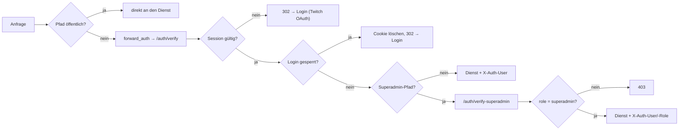

Rollen: **Superadmin** (`streamers.is_platform_admin`, Bootstrap über
`PLATFORM_ADMINS`) · **Team-Owner** (`teams.owner_login`) · **Team-Mitglied**
(`team_members`) · **Zuschauer** (eingeloggt) · **anonym**. Bewusste
Entscheidung: kein feineres Rollenmodell innerhalb eines Teams — jedes Mitglied
darf steuern und ziehen (`MEMBER_CMDS`).

---

## 8. Konfiguration

| Variable | Dienst | Wirkung |
|---|---|---|
| `PG_*`, `REDIS_*` | alle | Datenbanken; `REDIS_DB=0` Produktion, `1` für Tests gegen echtes Redis |
| `SESSION_SECRET` | admin | HMAC der Sitzungs-Cookies |
| `INTERNAL_API_KEY` | admin + giveaway | interne Endpunkte; leer = Endpunkte tot |
| `PLATFORM_ADMINS` | admin | Superadmins beim Bootstrap |
| `TWITCH_CLIENT_ID/SECRET` | admin + giveaway | OAuth und Helix |
| `DISCORD_FEEDBACK_WEBHOOK` | admin | Ziel der Rückmeldungen; leer = nur speichern |
| `ALLOW_SIM` | giveaway | Test-Console darf Ereignisse einspeisen (Produktion: aus) |
| `MAX_PARALLEL_GIVEAWAYS` | giveaway | Obergrenze gleichzeitiger Giveaways je Team (Vorgabe 4) |
| `CLAIM_DEADLINE_DAYS`, `CLAIM_RETENTION_DAYS` | giveaway | Meldefrist (14) und Löschfrist der Kontaktdaten (365) |
| `CHAT_MIN_WORDS`, `CHAT_BONUS_SEC` | giveaway | Vorgaben des Chat-Bonus |
| `TOS_VERSION` | admin **und** giveaway | Fassung der Nutzungsbedingungen — bei Textänderung **beide** erhöhen |
| `PUBLIC_URL`, `ADMIN_PUBLIC_URL` | beide | Adressen in Chat-Ansagen und Weiterleitungen |

---

## 9. Invarianten (was nicht gebrochen werden darf)

1. **Ziehen ist nie automatisch.** Einzige Ziehungsstelle ist
   `gw_draw_winner`, ausgelöst durch einen Klick. Kein Timer zieht.
2. **Reihenfolge: schließen → ziehen → aufräumen** — für jede Mechanik.
3. **Das Audit-Log wird nie gelöscht.** `runRetention()` anonymisiert nur.
   Gleiches gilt für `giveaway_draws`.
4. **Jede zustandsändernde Admin-Aktion läuft durch `handleAdminCmd`.**
   Zweiter Pfad ist die Test-Console-Simulation — die hat einen eigenen
   `audit()`-Aufruf und hängt an `ALLOW_SIM`.
5. **Kanal und Team kommen aus dem Ingest-Token**, nie aus der Nutzlast.
6. **Guthaben wird ausschließlich über `CreditLedger` gebucht**; es gibt keine
   Buchungstypen für Kauf oder Übertragung.
7. **Ein Giveaway verlost genau einen Preis.** Mehr Preise heißt: mehrere
   Los-Giveaways.
8. **Regeln gelten je Giveaway** (Copy-on-Open); Team-Werte sind nur Vorgaben.
9. **Ohne eingefrorene Bedingungen-Fassung startet kein Giveaway.**
10. **Neue personenbezogene Spalte?** Dann in `collectSubjectData()` **und**
    `eraseSubject()` mitziehen, sonst ist die Auskunft unvollständig und die
    Löschung wirkungslos.
11. **Neue Superadmin-Seite?** In die `@superadmin path`-Liste in
    `caddy/Caddyfile.team` eintragen, sonst reicht ein normaler Login.
12. **Neue öffentliche Seite?** In die `@needsauth not path`-Liste eintragen,
    sonst verlangt Caddy Login.

---

## Anhang A — vollständige Funktionslisten je Datei

Kurzform: Name, Zweck, Rückgabe. Reine Formathelfer (`esc`, `fmt*`) sind
zusammengefasst, weil sie überall dasselbe tun: Zeichenkette rein, sichere
Zeichenkette raus.

### A.1 `services/bridge/server.js` — Ingest

| Funktion | Zweck | Rückgabe |
|---|---|---|
| `log/logErr(tag, …)` | Protokollzeile mit Präfix | `void` |
| `redisReady()` | wartet beim Start auf Redis | `Promise<void>` |
| `unauthedCount()` | offene Verbindungen ohne Auth (Obergrenze gegen Flut) | `number` |
| `connectedChannels()` | aktuell verbundene Kanäle | `string[]` |
| `safeSend(ws, obj)` | sendet nur auf offener Verbindung | `void` |
| `subscribeToReplies()` | abonniert `ch:chat_reply`, stellt an den richtigen Bot zu | `void` |
| `wss.on('connection')` | Auth, Drosselung, Weiterleitung nach `ch:giveaway` | — |
| `GET /health` | Zustand inklusive verbundener Kanäle | JSON |
| `main()` | Startreihenfolge | `Promise<void>` |

### A.2 `services/admin/server.js` — Auth, Teams, Recht, Plattform

| Funktion | Zweck | Rückgabe |
|---|---|---|
| `sessionFromReq(req)` | Cookie prüfen | `{user, role}` oder `null` |
| `refreshBannedLogins()` | Sperrliste in den Cache | `void` |
| `loginKey/loginBlocked/loginFailed` | Login-Bremse (5 Fehlversuche → 15 min) | `string` / `boolean` / `void` |
| `requireSession(req,res)` · `requireSuperadmin(req,res)` | Zugriffsschutz je Endpunkt | Session oder `null` (Antwort ist dann schon geschrieben) |
| `requireTos(req,res,sess)` | erzwingt aktuelle Nutzungsbedingungen (HTTP 451) | `boolean` |
| `issueSession(res, login, role)` | Cookie setzen | `void` |
| `tosAcceptedVersion(login)` | zuletzt akzeptierte Fassung | `number` |
| `genId(prefix)` · `genCode()` | Team-ID · Einladungscode | `string` |
| `isTeamOwner/isTeamMember(teamId, login)` | Rechteprüfung | `boolean` |
| `auditTeam(...)` · `auditGdpr(...)` (= `auditPlatform`) | Protokolleintrag | `void` |
| `giveawayCleanup(teamId, channel?)` | ruft den internen Endpunkt des giveaway-Dienstes | `{ok}` oder `{error}` |
| `teamHasOpenGiveaway(teamId)` | Sperre für Kanalwechsel und Deaktivierung | `boolean` |
| `joinLimited(ip)` | Beitritts-Bremse (20/h) | `boolean` |
| `splitSections(md)` · `changedSections(a,b)` | Textvergleich der Bedingungen | `string[]` |
| `currentTermsVersion(teamId)` | geltende Fassung | `number` |
| `sanitizeViewer(v)` · `sanitizeTeamIdParam(v)` | Eingabeprüfung | `string` |
| `collectSubjectData(u)` | DSGVO-Auskunft über alle Tabellen | Objekt |
| `eraseSubject(u, actor, action)` | DSGVO-Löschung, Nachweise werden pseudonymisiert | Objekt mit Zählern |
| `ensureSchema()` | Quelle der Wahrheit für das Schema | `void` |
| `pgReady()` · `main()` | Start | `Promise<void>` |

### A.3 `services/giveaway/server.js` — restliche Funktionen

Die tragenden Teile stehen in Abschnitt 6.10; hier der Rest:

| Funktion | Zweck | Rückgabe |
|---|---|---|
| `loadMasterSecret()` · `rotateMasterSecret()` | Schlüssel für `app_secrets` | `string` · `{reencrypted, unreadable}` |
| `getAiConfig(T)` · `invalidateAiConfig(T)` | KI-Einstellungen je Team (entschlüsselt, gecacht) | Objekt · `void` |
| `aiJudge(T, message)` | Brücke Engine → `chat-ai.js` | `boolean` oder `null` |
| `ownsTeam/isMember/memberChannel(login, T)` | Rechte und Kanalzuordnung | `boolean` · `string`/`null` |
| `validGid(s)` | Formatprüfung der Sitzungs-ID | `string` oder `null` |
| `auditDetail(msg)` · `auditTarget(msg)` | was ins Protokoll darf (nie Tokens) | Objekt · `string`/`null` |
| `hasImprint/teamActive/ownerAcceptedTos(T)` | Start-Gates | `boolean` |
| `chatHost()` · `publicHost()` | Adressen für Chat-Ansagen | `string` |
| `secondaryStatusLines(T, ch)` · `giveawayInfoText(T)` | Antwort auf `!los` · `!giveaway` | `string[]` · `string` |
| `prizeLine(prize, sponsor)` | Gewinn-Zeile in Ansagen | `string` |
| `snapshotCoreConfig(T)` | Regel-Schnappschuss für `sessions.core_config` | Objekt |
| `setSessionStatus(T, status)` · `setSessionStatusById(gid, status)` | Sitzungsstatus | `void` |
| `placeholderBlockMsg(found)` | Klartext für das Platzhalter-Gate | `string` |
| `announceTeam/announceChannels(T, …)` | Ansage an alle bzw. ausgewählte Kanäle | `number` |
| `watchBoostExpiry()` · `seedBoostWatch()` | Ablauf des Multipliers ansagen | `void` |
| `shouldLogDeny(T, actor, cmd)` | Drosselung für Ablehnungen (5-Minuten-Fenster) | `boolean` |
| `reqUser(req)` | Login aus `X-Auth-User` | `string` |
| `auditFilters(q)` | Filter der Audit-Seite in SQL übersetzen | `{where, params}` |
| `viewerTeams(user, coreId)` | Teams, die für diesen Zuschauer zählen | `string[]` |
| `sniffImage(buf)` · `imageDims(buf, mime)` | Magic Bytes · Bildmaße | `string`/`null` · `{w,h}`/`null` |
| `contestInstance(T)` · `teamName(T)` | Nachschlagen | Objekt · `string` |
| `helixFollowFallback(T, gid, u)` | Follow-Prüfung, wenn das Live-Flag fehlt | `boolean` oder `null` |
| `subscribeToGiveaway()` | abonniert `ch:giveaway` und verteilt Ereignisse | `void` |
| `startWatchtimeTicker()` · `startInstantWatcher()` · `startRetentionJob()` | Hintergrundschleifen (60 s · 5 s · 24 h) | `void` |
| `closeInstantWindow(T, g)` | Fenster schließen, Ansage, Puls mitschicken | `void` |
| `ensureSchema()` · `main()` | Schema und Start | `void` |

### A.4 Browser-Skripte

| Datei | Umfang | Aufgabe |
|---|---|---|
| `giveaway/public/giveaway-admin.js` | 150 Funktionen | Panel: Übersicht, Teilnehmer, Regeln, Preise, Contest, Ziehung, Protokoll |
| `giveaway/public/giveaway-shared.js` | Bibliothek | `CC.validate.*`, `CC.audit.summary`, laedt die Nav |
| `giveaway/public/cc-defs.js` | Konstanten | einzige Quelle der Event- und Befehlslisten (fail-closed) |
| `giveaway/public/archive.js` | 24 | Archiv, Dossier, Nachweis-Export |
| `giveaway/public/audit.js` | 18 | Protokollseite mit Filtern und Verdichtung |
| `giveaway/public/claims.js` · `claim.js` | 13 · 7 | Gewinn-Abwicklung (Owner) · Gewinnermeldung (Gewinner) |
| `giveaway/public/wager.js` | 11 | Lose setzen, ein Block je Los-Giveaway |
| `giveaway/public/contest.js` | 9 | Einsenden und Bewerten |
| `admin/public/nav.js` | Bibliothek | **einzige Quelle der Hauptnavigation**: Bereiche, Rollenfilter, aktive Markierung, Mobile-Drawer, Tastatur/ARIA |
| `admin/public/admin-shared.js` | Bibliothek | `CC.validate`, laedt die Nav, TOS-Overlay, Verwarnungs-Banner |
| `admin/public/teams.js` | 29 | Team-Verwaltung, Rechtstexte, Ingest-Kanäle |
| `admin/public/platform.js` | 20 | Plattform-Verwaltung (Teams, Streamer, Verwarnungen) |
| `admin/public/betrieb.js` | 13 | Betrieb und Diagnose |
| `admin/public/giveaway-test.js` | 28 | Test-Console (Simulation, nur mit `ALLOW_SIM`) |
| `admin/public/users.js`, `index.js`, `feedback.js`, `pub-doc.js`, `rdoc-theme.js` | 2–5 | Benutzer, Startseite, Rückmeldung, Rechtstexte, Theme |

### A.5 Streamerbot-Actions (`services/admin/actions/*.cs`)

Einzige Quelle; der admin-Dienst liefert sie über `GET /pub/actions` zum
Kopieren aus.

| Action | Trigger in Streamerbot | Sendet |
|---|---|---|
| `CC_IngestConnect` | Core → WebSocket → Client → Opened | `ingest_auth` mit dem Kanal-Token |
| `CC_ChatReply` | Core → WebSocket → Client → Message | schreibt die Antwort in den Twitch-Chat |
| `GW_ViewerTick` | Twitch → General → Present Viewers | `viewer_tick` (nur bei laufendem OBS-Stream) |
| `GW_ChatMessage` | Twitch → Chat → Message | `chat_msg` (nur bei laufendem OBS-Stream) |
| `GW_StatusCmd` | Command `!los` und Aliase | `time_cmd` |
| `GW_GiveawayCmd` | Command `!giveaway` (Alias `!gw`) | `giveaway_cmd` |
| `GW_StreamOnline` · `GW_StreamOffline` | Twitch → Channel → Stream Online/Offline | `stream_online` · `stream_offline` |

Alle senden über `CPH.WebsocketSend(payload, 0)`; der Kanal steckt im Token,
nie in der Nutzlast.

### A.6 Tests

| Suite | Datei | Deckt ab |
|---|---|---|
| Engine | `services/giveaway/tests/watchtime.test.js` | Zeitkonto, Anmeldung, Instanzen, Ziehung, Preise, Contest, Kenntnisnahme, Ingest-Puls, Lebenszyklus |
| Cores | `services/giveaway/tests/cores.test.js` | Gleichheit gegen die eingefrorene Alt-Logik |
| Guthaben | `services/giveaway/tests/credit.test.js` | Vorzeichen, Saldo, Verfall |
| KI | `services/giveaway/tests/chat-ai.test.js` | Anbieter, Timeout, fail-open, Zwischenspeicher |
| Archiv | `services/giveaway/tests/targz.test.js` | ustar-Format |
| Fassungen | `services/giveaway/tests/terms.test.js` | Start-Gate der Bedingungen-Fassung |
| Ersatzziehung | `services/giveaway/tests/claim-rules.test.js` | wann ein Ersatz blockiert ist |
| Protokolltexte | `services/giveaway/tests/audit-summary.test.js` | Klartext je Protokollzeile |
| Auth | `services/admin/tests/auth.test.js` | Token, Cookies, Passwörter |
| Sperrliste | `services/admin/tests/ban-cache.test.js` | Login-Sperre im Cache |
| Browser | `services/admin/public/tests/test-suite.js` | Panel-Logik im Browser |

Alle Node-Suiten laufen **ohne Infrastruktur**: Redis und PostgreSQL sind
In-Memory-Nachbauten, `fetch` ist gestubbt.
